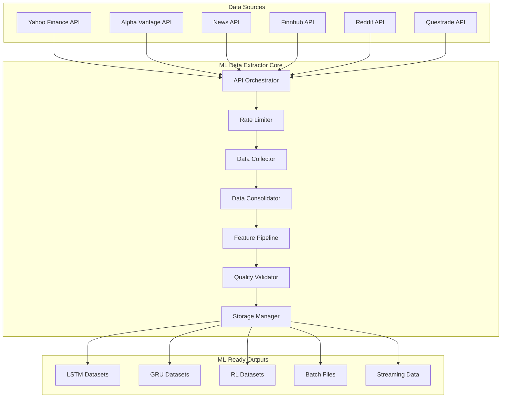
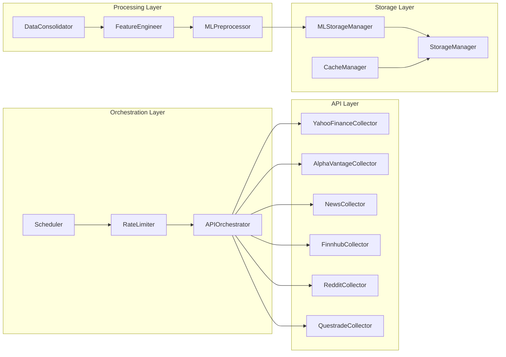

# ML Data Extractor Design Document

## Overview

The ML Data Extractor is a unified, high-performance data collection and preprocessing system that consolidates multiple financial data APIs into ML-ready datasets. Building upon the existing data collection infrastructure, this system creates a streamlined pipeline optimized for training LSTM, GRU, and reinforcement learning models on Canadian market data.

The system leverages existing components (SymbolManager, StorageManager, DataValidator, AlphaVantageCollector) while adding new ML-specific features for feature engineering, multi-source data fusion, and optimized storage formats.

## Architecture

### High-Level Architecture



### Component Architecture



## Components and Interfaces

### 1. APIOrchestrator

**Purpose**: Coordinates data collection across multiple API sources with intelligent fallback and redundancy.

**Key Methods**:
```python
class APIOrchestrator:
    def __init__(self, config: Dict[str, Any])
    def detect_available_apis(self) -> Dict[str, bool]
    def collect_market_data(self, symbols: List[str], timeframe: str) -> Dict[str, pd.DataFrame]
    def collect_news_data(self, symbols: List[str], lookback_days: int) -> Dict[str, List[Dict]]
    def collect_sentiment_data(self, symbols: List[str]) -> Dict[str, float]
    def get_api_health_status(self) -> Dict[str, Dict[str, Any]]
```

**Features**:
- Automatic API key detection from environment variables
- Intelligent source prioritization (Yahoo Finance primary, Alpha Vantage backup)
- Parallel data collection with configurable concurrency
- Automatic failover between data sources
- Real-time API health monitoring

### 2. DataConsolidator

**Purpose**: Merges data from multiple sources with temporal alignment and conflict resolution.

**Key Methods**:
```python
class DataConsolidator:
    def __init__(self, priority_rules: Dict[str, int])
    def align_temporal_data(self, datasets: Dict[str, pd.DataFrame], target_frequency: str) -> pd.DataFrame
    def merge_price_data(self, primary: pd.DataFrame, secondary: pd.DataFrame) -> pd.DataFrame
    def consolidate_news_sentiment(self, news_sources: Dict[str, List[Dict]]) -> pd.DataFrame
    def handle_missing_data(self, data: pd.DataFrame, strategy: str) -> pd.DataFrame
```

**Features**:
- Configurable source priority (Yahoo Finance > Alpha Vantage > Questrade)
- Smart gap filling using multiple data sources
- Timezone-aware temporal alignment
- Conflict resolution for overlapping data points
- Market hours and holiday handling

### 3. FeatureEngineer

**Purpose**: Transforms raw market data into ML-ready features with comprehensive technical indicators.

**Key Methods**:
```python
class FeatureEngineer:
    def __init__(self, config: FeatureConfig)
    def generate_technical_indicators(self, price_data: pd.DataFrame) -> pd.DataFrame
    def create_sentiment_features(self, news_data: pd.DataFrame, price_data: pd.DataFrame) -> pd.DataFrame
    def generate_time_series_features(self, data: pd.DataFrame, lookback_windows: List[int]) -> pd.DataFrame
    def create_volatility_features(self, price_data: pd.DataFrame) -> pd.DataFrame
    def normalize_features(self, features: pd.DataFrame, method: str) -> Tuple[pd.DataFrame, Dict]
```

**Technical Indicators**:
- **Trend**: SMA, EMA, MACD, ADX, Parabolic SAR
- **Momentum**: RSI, Stochastic, Williams %R, Rate of Change
- **Volatility**: Bollinger Bands, ATR, Keltner Channels
- **Volume**: OBV, Volume SMA, VWAP, Accumulation/Distribution
- **Custom**: Price position, volatility regimes, trend strength

**Sentiment Features**:
- News headline sentiment scores (compound, positive, negative, neutral)
- Reddit mention frequency and sentiment
- Social media buzz indicators
- News event classification (earnings, dividends, analyst upgrades)

### 4. MLPreprocessor

**Purpose**: Prepares features specifically for different ML model architectures.

**Key Methods**:
```python
class MLPreprocessor:
    def __init__(self, config: MLConfig)
    def create_lstm_sequences(self, features: pd.DataFrame, target: pd.Series, sequence_length: int) -> Tuple[np.ndarray, np.ndarray]
    def create_rl_environment_data(self, features: pd.DataFrame, actions: pd.Series, rewards: pd.Series) -> Dict[str, np.ndarray]
    def generate_train_val_test_splits(self, data: pd.DataFrame, split_ratios: Tuple[float, float, float]) -> Tuple[pd.DataFrame, pd.DataFrame, pd.DataFrame]
    def create_feature_metadata(self, features: pd.DataFrame) -> Dict[str, Any]
    def export_to_ml_formats(self, data: Dict[str, np.ndarray], format: str, output_path: str) -> bool
```

**ML-Specific Outputs**:
- **LSTM/GRU**: 3D arrays (samples, timesteps, features) with proper sequence windowing
- **Reinforcement Learning**: State-action-reward tuples with environment metadata
- **Supervised Learning**: Feature matrices with target variables
- **Time Series**: Properly lagged features with temporal ordering preservation

### 5. MLStorageManager

**Purpose**: Optimized storage for ML datasets with efficient retrieval and versioning.

**Key Methods**:
```python
class MLStorageManager:
    def __init__(self, base_path: str, compression: str = "snappy")
    def save_ml_dataset(self, dataset: Dict[str, np.ndarray], metadata: Dict, version: str) -> str
    def load_ml_dataset(self, dataset_id: str, version: str = "latest") -> Tuple[Dict[str, np.ndarray], Dict]
    def create_data_partition(self, symbol: str, timeframe: str, start_date: datetime, end_date: datetime) -> str
    def get_streaming_iterator(self, dataset_id: str, batch_size: int) -> Iterator[Dict[str, np.ndarray]]
    def cleanup_old_versions(self, keep_versions: int = 5) -> None
```

**Storage Features**:
- **Parquet with Snappy compression** for optimal size/speed balance
- **Partitioning by symbol and date** for fast querying
- **Version control** for dataset iterations
- **Metadata tracking** for feature lineage and scaling parameters
- **Streaming support** for large datasets that don't fit in memory

### 6. RateLimiter

**Purpose**: Manages API request limits across all data sources to prevent quota exhaustion.

**Key Methods**:
```python
class RateLimiter:
    def __init__(self, api_limits: Dict[str, Dict[str, int]])
    def acquire_permit(self, api_name: str, request_type: str) -> bool
    def get_remaining_quota(self, api_name: str) -> Dict[str, int]
    def estimate_completion_time(self, total_requests: int, api_name: str) -> timedelta
    def optimize_request_schedule(self, requests: List[APIRequest]) -> List[APIRequest]
```

**Rate Limiting Strategy**:
- **Yahoo Finance**: 10 requests/second (no official limit, conservative)
- **Alpha Vantage**: 5 requests/minute (free tier), 75/minute (premium)
- **News API**: 1000 requests/day (free tier)
- **Finnhub**: 60 requests/minute (free tier)
- **Reddit API**: 100 requests/minute
- **Questrade**: 100 requests/second

## Data Models

### Core Data Structures

```python
@dataclass
class MarketDataPoint:
    timestamp: datetime
    symbol: str
    open: float
    high: float
    low: float
    close: float
    volume: int
    source: str
    quality_score: float

@dataclass
class NewsItem:
    timestamp: datetime
    symbol: str
    headline: str
    summary: str
    sentiment_score: float
    source: str
    url: str

@dataclass
class FeatureVector:
    timestamp: datetime
    symbol: str
    features: Dict[str, float]
    metadata: Dict[str, Any]

@dataclass
class MLDataset:
    features: np.ndarray
    targets: np.ndarray
    timestamps: np.ndarray
    symbols: List[str]
    feature_names: List[str]
    metadata: Dict[str, Any]
```

### Database Schema (SQLite for metadata)

```sql
-- Dataset registry
CREATE TABLE ml_datasets (
    id TEXT PRIMARY KEY,
    name TEXT NOT NULL,
    version TEXT NOT NULL,
    created_at TIMESTAMP DEFAULT CURRENT_TIMESTAMP,
    symbols TEXT,  -- JSON array
    timeframe TEXT,
    start_date DATE,
    end_date DATE,
    feature_count INTEGER,
    sample_count INTEGER,
    file_path TEXT,
    metadata TEXT  -- JSON
);

-- Feature definitions
CREATE TABLE feature_definitions (
    name TEXT PRIMARY KEY,
    category TEXT,
    description TEXT,
    calculation_method TEXT,
    dependencies TEXT,  -- JSON array
    normalization_params TEXT  -- JSON
);

-- Data quality metrics
CREATE TABLE quality_metrics (
    dataset_id TEXT,
    symbol TEXT,
    timeframe TEXT,
    completeness_score REAL,
    consistency_score REAL,
    quality_score REAL,
    issues_count INTEGER,
    warnings_count INTEGER,
    created_at TIMESTAMP DEFAULT CURRENT_TIMESTAMP,
    FOREIGN KEY (dataset_id) REFERENCES ml_datasets(id)
);
```

## Error Handling

### API Error Handling Strategy

```python
class APIErrorHandler:
    def handle_rate_limit(self, api_name: str, retry_after: int) -> None:
        """Handle rate limit errors with exponential backoff"""
        
    def handle_authentication_error(self, api_name: str) -> bool:
        """Handle API key issues"""
        
    def handle_data_unavailable(self, symbol: str, api_name: str) -> Optional[str]:
        """Handle missing data with fallback sources"""
        
    def handle_network_error(self, error: Exception, retry_count: int) -> bool:
        """Handle network connectivity issues"""
```

**Error Recovery Strategies**:
1. **Rate Limits**: Exponential backoff with jitter, automatic queue management
2. **Authentication**: Automatic key rotation, fallback to alternative sources
3. **Network Issues**: Retry with circuit breaker pattern, offline mode support
4. **Data Quality**: Automatic validation, flagging, and correction attempts
5. **Storage Errors**: Automatic backup, corruption detection and recovery

### Data Quality Error Handling

```python
class DataQualityHandler:
    def handle_missing_data(self, data: pd.DataFrame, strategy: str) -> pd.DataFrame:
        """Fill missing data using forward-fill, interpolation, or source switching"""
        
    def handle_outliers(self, data: pd.DataFrame, method: str) -> pd.DataFrame:
        """Detect and handle statistical outliers"""
        
    def handle_inconsistent_data(self, data: pd.DataFrame) -> pd.DataFrame:
        """Fix OHLC inconsistencies and impossible values"""
        
    def handle_temporal_gaps(self, data: pd.DataFrame, max_gap: timedelta) -> pd.DataFrame:
        """Handle gaps in time series data"""
```

## Testing Strategy

### Unit Testing

**Core Components**:
- `test_api_orchestrator.py`: API coordination and fallback logic
- `test_data_consolidator.py`: Multi-source data merging and alignment
- `test_feature_engineer.py`: Technical indicator calculations and feature generation
- `test_ml_preprocessor.py`: ML-specific data preparation and formatting
- `test_rate_limiter.py`: API quota management and request scheduling

**Mock Data Strategy**:
- Use realistic market data samples for testing
- Mock API responses with various error conditions
- Test edge cases (market holidays, extreme volatility, missing data)

### Integration Testing

**End-to-End Workflows**:
- `test_full_data_pipeline.py`: Complete data collection to ML dataset creation
- `test_multi_source_collection.py`: Collecting from all available APIs simultaneously
- `test_real_time_streaming.py`: Live data collection and processing
- `test_large_dataset_creation.py`: Performance testing with full symbol universe

### Performance Testing

**Benchmarks**:
- Data collection speed: Target 100 symbols in under 10 minutes
- Feature engineering throughput: Target 1M data points per minute
- Storage efficiency: Target 80% compression ratio
- Memory usage: Target <4GB for full dataset processing

### Data Quality Testing

**Validation Tests**:
- Cross-source data consistency verification
- Feature calculation accuracy validation
- ML dataset format compliance testing
- Temporal alignment precision testing

## Performance Considerations

### Optimization Strategies

**Data Collection**:
- Parallel API requests with configurable concurrency (default: 5 concurrent)
- Intelligent caching to avoid redundant API calls
- Incremental updates to minimize data transfer
- Request batching where supported by APIs

**Feature Engineering**:
- Vectorized operations using NumPy and Pandas
- Lazy evaluation for expensive calculations
- Caching of intermediate results
- Parallel processing for independent calculations

**Storage**:
- Columnar storage (Parquet) for analytical workloads
- Snappy compression for optimal size/speed balance
- Partitioning by symbol and date for fast querying
- Bloom filters for efficient data skipping

**Memory Management**:
- Streaming processing for large datasets
- Configurable batch sizes based on available memory
- Automatic garbage collection of intermediate results
- Memory-mapped file access for large arrays

### Scalability Design

**Horizontal Scaling**:
- Stateless design allows multiple instances
- Symbol-based partitioning for parallel processing
- Queue-based task distribution
- Shared storage backend (NFS/S3 compatible)

**Vertical Scaling**:
- Multi-threading for I/O bound operations
- Multi-processing for CPU bound calculations
- GPU acceleration support for feature engineering
- Configurable resource limits

## Configuration Management

### Configuration Structure

```yaml
# ml_data_extractor_config.yaml
api_sources:
  yahoo_finance:
    enabled: true
    priority: 1
    rate_limit: 10  # requests per second
    
  alpha_vantage:
    enabled: true
    priority: 2
    rate_limit: 5   # requests per minute
    api_key_env: "ALPHA_VANTAGE_API_KEY"
    
  news_api:
    enabled: true
    priority: 3
    rate_limit: 1000  # requests per day
    api_key_env: "NEWS_API_KEY"

feature_engineering:
  technical_indicators:
    - name: "sma"
      periods: [5, 10, 20, 50, 200]
    - name: "rsi"
      period: 14
    - name: "macd"
      fast: 12
      slow: 26
      signal: 9
      
  sentiment_features:
    news_lookback_days: 7
    reddit_lookback_days: 3
    sentiment_smoothing: 0.1
    
  time_series_features:
    lag_periods: [1, 2, 3, 5, 10]
    rolling_windows: [5, 10, 20]
    
ml_preprocessing:
  lstm_config:
    sequence_length: 60
    prediction_horizon: 1
    overlap_ratio: 0.5
    
  rl_config:
    state_features: ["price_features", "technical_indicators", "sentiment"]
    action_space: ["buy", "sell", "hold"]
    reward_calculation: "sharpe_ratio"
    
storage:
  base_path: "MLData"
  compression: "snappy"
  partition_by: ["symbol", "year", "month"]
  max_file_size_mb: 100
  retention_days: 365
  
performance:
  max_concurrent_requests: 5
  batch_size: 1000
  memory_limit_gb: 4
  enable_caching: true
  cache_ttl_hours: 24
```

### Environment Variables

```bash
# Required API Keys
ALPHA_VANTAGE_API_KEY=your_key_here
NEWS_API_KEY=your_key_here
FINNHUB_API_KEY=your_key_here
REDDIT_CLIENT_ID=your_id_here
REDDIT_CLIENT_SECRET=your_secret_here
QUESTRADE_REFRESH_TOKEN=your_token_here

# Optional Configuration
ML_DATA_EXTRACTOR_CONFIG_PATH=/path/to/config.yaml
ML_DATA_EXTRACTOR_LOG_LEVEL=INFO
ML_DATA_EXTRACTOR_CACHE_DIR=/path/to/cache
```

## Security Considerations

### API Key Management

**Security Measures**:
- Environment variable storage (never in code)
- Automatic key rotation support
- Encrypted storage for cached tokens
- Audit logging of API key usage
- Rate limit monitoring to prevent abuse

### Data Privacy

**Privacy Protection**:
- No personal data collection (market data only)
- Secure transmission (HTTPS only)
- Local data storage (no cloud transmission without explicit consent)
- Data retention policies
- Audit trails for data access

### Access Control

**Security Controls**:
- File system permissions for data directories
- Process isolation for data collection
- Network security (firewall rules for API access)
- Input validation for all external data
- SQL injection prevention in metadata queries

## Monitoring and Observability

### Metrics Collection

**Key Metrics**:
- API response times and success rates
- Data quality scores by symbol and timeframe
- Feature engineering processing times
- Storage utilization and growth rates
- Memory and CPU usage patterns

### Logging Strategy

**Log Levels**:
- **ERROR**: API failures, data corruption, system errors
- **WARN**: Data quality issues, rate limit warnings, fallback usage
- **INFO**: Collection progress, dataset creation, performance milestones
- **DEBUG**: Detailed API interactions, feature calculations, cache operations

### Alerting

**Alert Conditions**:
- API quota exhaustion (>90% usage)
- Data quality degradation (quality score <0.8)
- Storage space warnings (>80% full)
- Processing delays (>2x expected time)
- System resource exhaustion (>90% memory/CPU)

## Deployment Considerations

### System Requirements

**Minimum Requirements**:
- Python 3.8+
- 4GB RAM
- 50GB storage space
- Stable internet connection (10 Mbps+)

**Recommended Requirements**:
- Python 3.10+
- 16GB RAM
- 500GB SSD storage
- High-speed internet (100 Mbps+)
- Multi-core CPU (8+ cores)

### Dependencies

**Core Dependencies**:
```
pandas>=1.5.0
numpy>=1.21.0
pyarrow>=10.0.0
requests>=2.28.0
yfinance>=0.2.0
scikit-learn>=1.1.0
sqlalchemy>=1.4.0
pyyaml>=6.0
```

**Optional Dependencies**:
```
talib>=0.4.0  # Advanced technical indicators
redis>=4.0.0  # Distributed caching
dask>=2022.0  # Distributed computing
```

### Installation and Setup

**Installation Steps**:
1. Install Python dependencies
2. Configure API keys in environment variables
3. Initialize storage directories and database
4. Run connectivity tests for all APIs
5. Perform initial data collection test
6. Set up monitoring and logging

This design provides a comprehensive, scalable, and maintainable solution for ML data extraction that builds upon your existing infrastructure while adding the specialized capabilities needed for machine learning workflows.